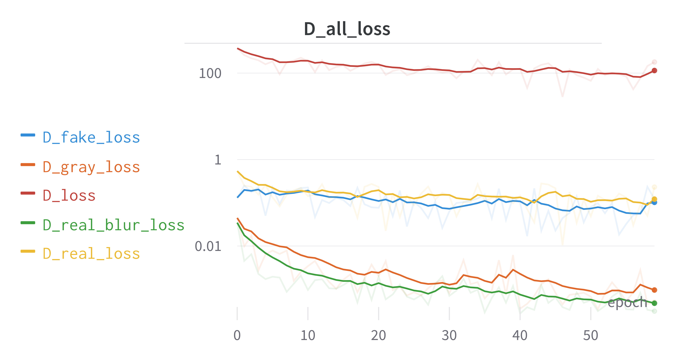
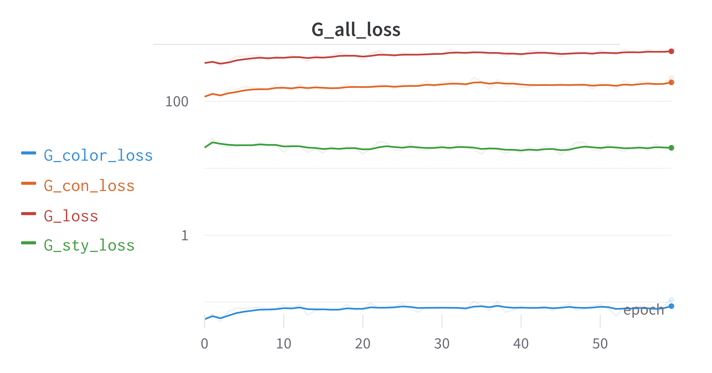
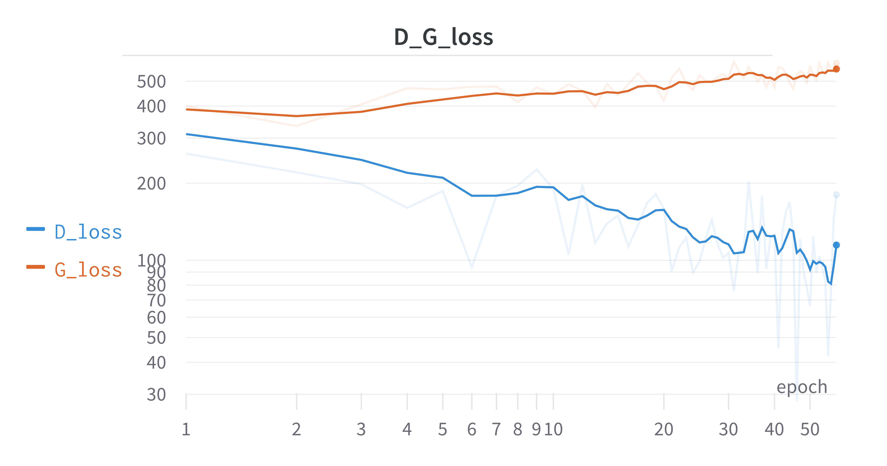

# AnimeGANv2_Pytorch     [中文](README_ZH.md)
Reference source [AnimeGANv2](https://github.com/TachibanaYoshino/AnimeGAN) project, rewritten with Pytorch to implement

## Installation and testing environment

GPU：3060 batch_size=10 训练耗时为13min/epoch

- torch==1.10.1
- pytorch-lightning==1.7.7
- wandb
- tqdm==4.64.0
- PyYAML
- opencv-python==4.5.5.64

## Usage

#### Initialization training

```shell
python train.py --config_path config/config-init.yaml --init_train_flag True
```

- `--config_path` The path of the configuration file, default is `config/config-init.yaml`
- `---init_train_flag` whether to initialize the training, if `True`, the generator network with the specified epoch will be trained according to the configuration file, the discriminator network will not be trained.
After training, the weights of the generator network will be saved and used for subsequent finetune training.

#### Formal training

```shell
python train.py --config_path config/config-defaults.yaml --init_train_flag False --pre_train_weight checkpoint/initAnimeGan/Hayao/epoch\=4-step\=3330-v1.ckpt
```

- `--config_path` The path to the configuration file, default is `config/config-defaults.yaml`
- `---init_train_flag` whether to initialize the training, if `False`, the generator network and discriminator network will be trained according to the config file for the specified epoch
- `--pre_train_weight` Pre-train weights, you can load the initialized generator network weights for finetune training, and then train them into a new model
- `--resume_ckpt_path` breakpoint training, you can load the previously trained model to continue training


### Testing

```shell
python test.py --model_dir checkpoint/animeGan/Hayao/epoch=59-step=79920-v1.ckpt --test_file_path "dataset/test/HR_photo/1 (55).jpg"
```

- `--model_dir` Model path
- `--test_file_path` Test image path

### Export Model

```shell
python export_model.py --checkpoint_path checkpoint/animeGan/Hayao/epoch=59-step=79920-v1.ckpt --dynamic
```

- `--checkpoint_path` Model path
- `--onnx` whether to export the onnx model
- `--pytorch` whether to export the pytorch model
- `--torchscript` whether to export the torchscript model
- `--dynamic` whether to export input with dynamic dimensions on onnx model

## Training process

### loss variation

Discriminator related losses




Generator related losses




Relative change in loss of generators and discriminators



As can be seen from the loss, the generator and discriminator produced an obvious confrontation effect, the generator loss into an upward trend, discriminator loss into a downward trend, due to the training of the relevant loss weight is in accordance with the way recommended by the original author, and the original author training effect has a certain difference, you need to adjust again

### Image verification results


## License
- This version is for academic research and non-commercial use only, if used for commercial purposes, please contact me for licensing approval