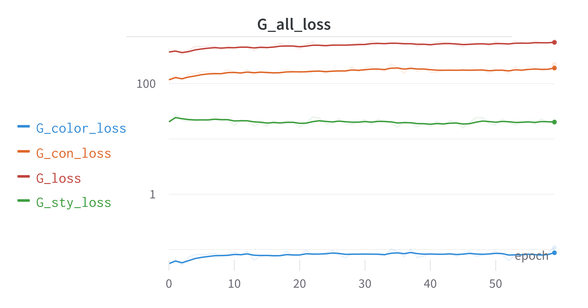

# AnimeGANv2_Pytorch
参考源 [AnimeGANv2](https://github.com/TachibanaYoshino/AnimeGAN) 项目，用Pytorch去改写实现

## 安装和测试环境

GPU：3060 batch_size=10 训练耗时为13min/epoch

- torch==1.10.1
- pytorch-lightning==1.7.7
- wandb
- tqdm==4.64.0
- PyYAML
- opencv-python==4.5.5.64

## 使用

### 训练

#### 初始化训练

```shell
python train.py --config_path config/config-init.yaml --init_train_flag True
```

- `--config_path` 配置文件路径，默认为`config/config-init.yaml`
- `--init_train_flag` 是否初始化训练，如果为`True`，则会根据配置文件训练指定epoch的generator网络，discriminator网络不会训练，
训练完成后会保存generator网络的权重，用于后续的finetune训练

#### 正式训练

```shell
python train.py --config_path config/config-defaults.yaml --init_train_flag False --pre_train_weight checkpoint/initAnimeGan/Hayao/epoch\=4-step\=3330-v1.ckpt
```

- `--config_path` 配置文件路径，默认为`config/config-defaults.yaml`
- `--init_train_flag` 是否初始化训练，如果为`False`，则会根据配置文件训练指定epoch的generator网络和discriminator网络
- `--pre_train_weight` 预训练权重，可以加载之前初始化训练的generator网络权重进行finetune训练，然后再训练成新的模型
- `--resume_ckpt_path` 断点续训，可以加载之前训练的模型进行继续训练


### 测试

```shell
python test.py --model_dir checkpoint/animeGan/Hayao/epoch=59-step=79920-v1.ckpt --test_file_path "dataset/test/HR_photo/1 (55).jpg"
```

- `--model_dir` 模型路径
- `--test_file_path` 测试图片路径

### 导出模型

```shell
python export_model.py --checkpoint_path checkpoint/animeGan/Hayao/epoch=59-step=79920-v1.ckpt --dynamic
```

- `--checkpoint_path` 模型路径
- `--onnx` 是否导出onnx模型
- `--pytorch` 是否导出pytorch模型
- `--torchscript` 是否导出torchscript模型
- `--dynamic` 是否导出动态属于维度的onnx模型

## 训练过程

### loss变化

判别器相关loss


生成器相关loss




生成器和判别器的loss相对变化


由loss可见，生成器和判别器产生了明显的对抗效果，生成器的loss成上升趋势，判别器loss成下降趋势，由于训练的相关loss权重是按照原作者推荐的方式来的，与原作者训练的效果有一定出入，需要自己再进行调整

### 图片验证结果


## License
- 此版本仅用于学术研究和非商业用途，如果用于商业目的，请联系我以获得授权批准